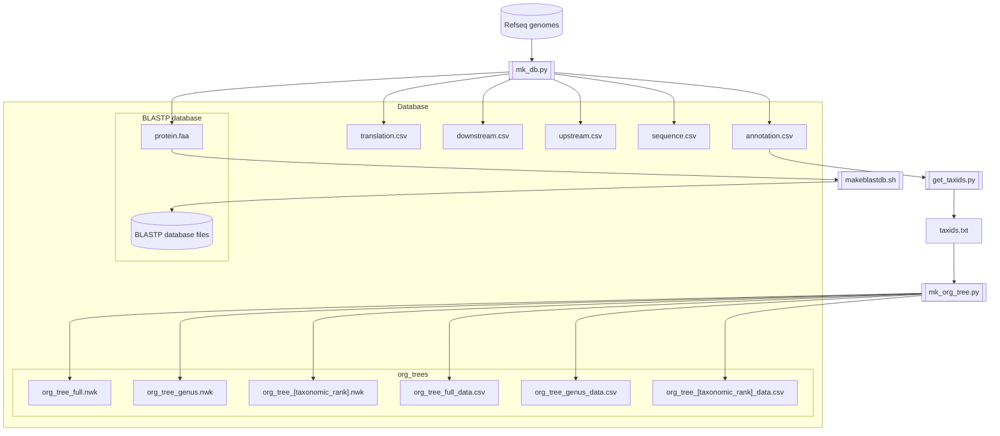

# Database building
These scripts are a part of the first component of the tool - I. Database Building

# Flowchart

```mermaid
flowchart TD
	Refseq_genomes[(Refseq genomes)] --> MK_INP[[mk_db.py]]
	--> protein.faa --> makeblastdb[[makeblastdb.sh]]
	makeblastdb[[makeblastdb.sh]]
	-->
	BDB[(BLASTP database files)]
	MK_INP --> annotation.csv
	MK_INP --> translation.csv
	MK_INP --> downstream.csv
	MK_INP --> upstream.csv
	MK_INP --> sequence.csv
	annotation.csv --> get_taxids[[get_taxids.py]] --> taxids[taxids.txt]
	-->
	orgtreePY[[mk_org_tree.py]] --> full[org_tree_full.nwk]
	orgtreePY --> genus[org_tree_genus.nwk]
	orgtreePY --> tr["org_tree_[taxonomic_rank].nwk"]

	orgtreePY[[mk_org_tree.py]] --> full_d[org_tree_full_data.csv]
	orgtreePY ----> genus_d[org_tree_genus_data.csv]
	orgtreePY ----> tr_d["org_tree_[taxonomic_rank]_data.csv"]

	subgraph Database
		annotation.csv
		translation.csv
		downstream.csv
		upstream.csv
		sequence.csv
		
		subgraph BLASTP database
			protein.faa
			BDB
		end
		
		subgraph org_trees
			full
			genus
			tr
			full_d
			genus_d
			tr_d
		end
	end
```